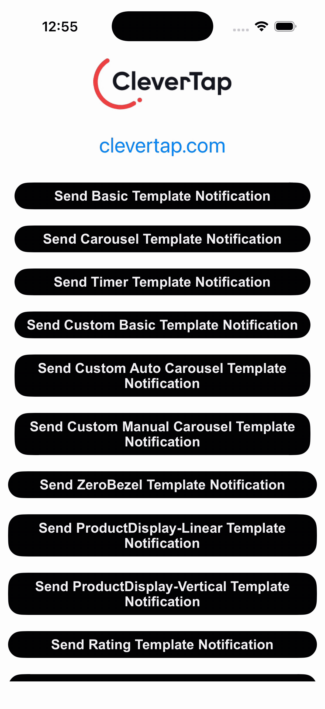
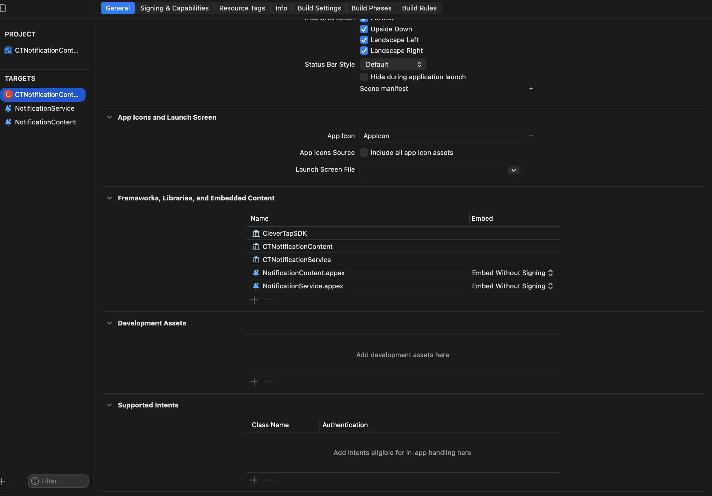
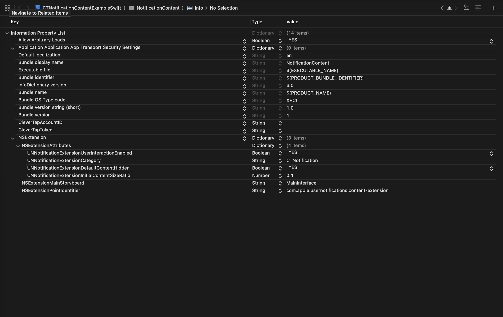

# CTNotificationContent - developer debug guide

This guide walks you through the common reasons a CleverTap notification content
extension fails to show its custom UI, and how to fix each one. Work through the
sections in order - most issues are caught in the first two.

## 1. Check how you integrated the library

The way the `CTNotificationContent` framework is linked differs between Swift
Package Manager and CocoaPods. Pick the section that matches your setup.

### Swift Package Manager (SPM)

SPM does not automatically attach the content extension to your app target, so
the library may never get linked into the app.

If you get an error like this at launch, follow the steps below:

```
dyld: Library not loaded: @rpath/YourLibrary.framework/YourLibrary
  Referenced from: .../YourApp.app/YourApp
  Reason: image not found
```



1. Open Xcode and select your **app target**.
2. Go to **General → Frameworks, Libraries, and Embedded Content**.
3. Confirm `CTNotificationContent` is listed there.
4. If it is missing, add it to the app target and build again.



If it is already listed but the problem continues, clear out any stale build or
dependency state:

- Clean Derived Data in Xcode.
- Reset the Swift Package Manager cache.
- Rebuild and check whether the issue persists.

### CocoaPods

- Clean Derived Data in Xcode.
- Delete the `Pods/` folder and `Podfile.lock`.
- Run `pod install`.
- Rebuild and check whether the issue persists.

## 2. Confirm the content extension actually runs

Use Xcode's debugger to verify the extension process is created, and that your
code actually runs, when a notification expands.

1. Trigger a push notification and expand it. This starts the extension process.
2. In Xcode, check whether the content extension process appears.
3. Go to **Debug → Attach to Process** and attach to that content extension.
4. Add a breakpoint in your subclass, trigger and expand another notification,
   and confirm the breakpoint is hit - this proves the call reaches your class.

If the content extension still does not show up as a process:

- Check that the relevant certificates are valid.
- Try removing and re-adding the content extension, then repeat the steps above.

## 3. Make sure the category matches

For a content extension to display its custom UI, the notification payload must
include a `"category": "YOUR_CATEGORY_ID"` string. That identifier has to match
**exactly** in three places:

- The `category` value in the push payload.
- `UNNotificationExtensionCategory` in the content extension's `Info.plist`.
- The category you registered in your app delegate.

If any of these differ, the system falls back to the default notification UI.



## 4. Verify the payload

Finally, inspect the push payload itself:

- Check that the template `id` is present.
- Check that all required keys for your template are present in the payload.
